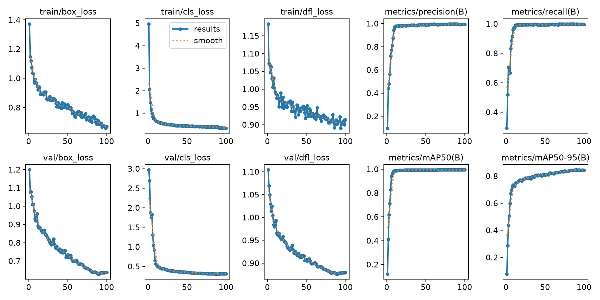
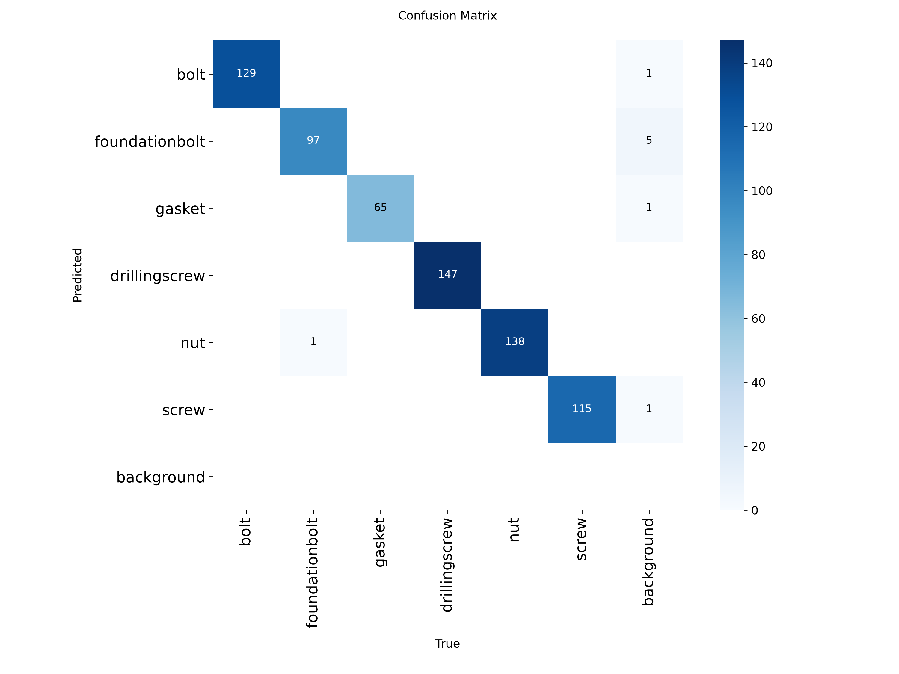
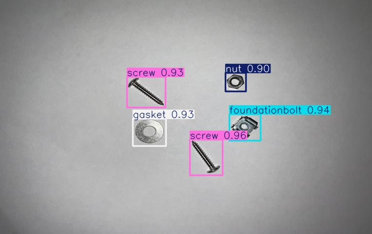
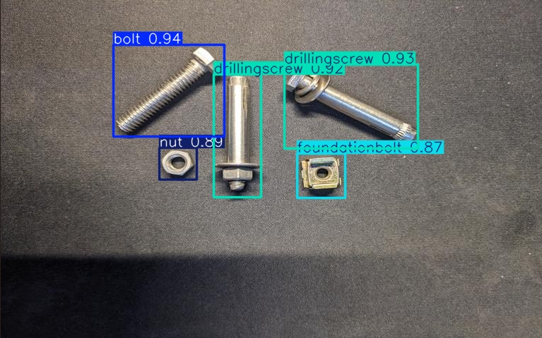
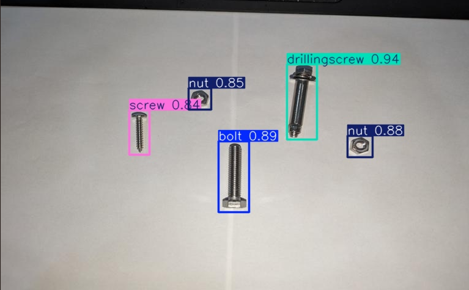

# 金屬零件辨識與計數 (Metal Parts Recognition & Counting)

工廠輸送帶上的金屬零件（螺栓、螺帽、墊片、螺絲等），原本仰賴人工分類與
計數。本專案目標是導入影像辨識技術，自動辨別零件種類並計數，降低人力
依賴、提升產線效率。

> 本 repo 同時保留專案的 **MATLAB 驗證階段**程式碼，以及正在進行的
> **Python 重構**。完整脈絡與決策過程說明如下。

---

## 專案脈絡

| 階段 | 內容 | 狀態 |
|---|---|---|
| 1. 提案 | 構想以 GoogLeNet 做影像分類，目標辨識率 80%+ | 完成（見 `matlab_legacy/proposal/`） |
| 2. MATLAB 驗證 | 實作 Faster R-CNN 物件偵測 + GoogLeNet 分類兩種方法 | 已執行，程式碼與資料集留存，後續轉換為 YOLO 格式（見下方說明） |
| 3. Python 重構 — YOLOv8 | 改用 PyTorch + Ultralytics YOLOv8 重新訓練物件偵測模型 | 已完成訓練，mAP50 達 99.5%（見下方「訓練成果」） |
| 4. Python 重構 — 分類對照組 | CNN 分類（torchvision），作為與 YOLOv8 的方法比較 | 待規劃資料集 |

### 為什麼方法跟提案不一致？

原始提案（`matlab_legacy/proposal/金屬探測.pptx`）規劃單純使用 GoogLeNet
做分類。實際開發過程中，方法演進為**兩條路線並行比較**：

1. **Faster R-CNN**（`metal.m`）：物件偵測，可同時定位零件位置並計數，
   類別涵蓋 Bolt、Foundation bolt、Gasket、Drilling screw、Nut、Screw 共 6 類。
2. **GoogLeNet 分類**（`googlenet_classification.m`）：影像分類取向，
   延續提案方向；但此程式對應的資料集類別**已無法確認**是否為金屬零件
   （詳見程式說明文件），列為待確認項目。

### 資料集與轉換過程

MATLAB 階段使用的訓練影像共 150 張，與提案規模吻合。標註檔
（`train_label.mat` / `test_label.mat`）是 MATLAB 專屬的 `groundTruth`
物件（MCOS 序列化格式），無法用 Python 直接解析，因此透過 MATLAB Online
（學校提供的免費雲端授權）執行展開腳本，將標註匯出為通用 CSV 格式，
再以 Python 轉換為 YOLO 格式，並以實際疊框視覺化驗證轉換正確性
（無錯位、類別對應無誤）。完整資料集與標註現已納入本 repo（見 `python/data/`）。

預訓練的 GoogLeNet layer graph（`googLeNet_4.mat`）及其對應訓練資料夾
`new/` 的類別目前無法考證是否為金屬零件，分類對照組需重新規劃資料蒐集。

---

## 訓練成果（YOLOv8）

### 環境與設定

| 項目 | 內容 |
|---|---|
| 硬體 | NVIDIA RTX 3080 (12GB VRAM) |
| 模型 | YOLOv8s（Ultralytics） |
| 訓練資料 | 135 張（test 集 15 張獨立未參與訓練） |
| Epochs | 100（無 early stop 觸發，patience=20） |
| Optimizer | Adam，lr0=0.0001 |
| 訓練時間 | 約 3.6 分鐘（219 秒，100 epochs） |

### 評估指標

| 指標 | 數值 |
|---|---|
| Precision | 99.4% |
| Recall | 99.6% |
| **mAP50** | **99.5%** |
| mAP50-95 | 84.3% |

> 原提案目標為「辨識率高於 80%」，mAP50 99.5% 大幅超越此目標。

訓練曲線顯示 loss 穩定下降、無明顯震盪或 overfitting 跡象：



Confusion matrix 顯示 **6 個類別之間零互相混淆**，唯一的誤判集中在
「漏判為 background」（少數 foundationbolt、bolt、gasket、screw 個案），
代表模型偶爾會漏掉物件，但從未將某類別誤判為另一類別：



> 註：目前驗證集（val）暫用訓練集本身（資料量僅 135 張，尚未切分獨立 val
> set），故以上數值在驗證階段略偏樂觀；test 集（15 張，訓練全程未參與）
> 上的實際推論效果如下方範例所示，結果與驗證階段一致。

### 推論範例

| 情境 | 結果 |
|---|---|
| 白色背景，5 個零件 |  |
| 深色背景，零件相鄰密集（呼應提案中「物體相距過近」的預期困難） |  |
| 白色背景，混合類別 |  |

中間那張圖特別值得一提：原始提案的「預計遇到困難」清單第一條就是
「當物體相距過近時，造成辨識錯誤率增加」。這張圖裡兩個 drillingscrew
的偵測框實際上有重疊，模型仍準確區分，算是直接驗證模型有處理到提案
當初擔心的痛點。

### 取得訓練好的模型

```python
from ultralytics import YOLO

model = YOLO("python/results/best.pt")
results = model.predict(source="你的圖片路徑.jpg", conf=0.5)
```

---

## 目錄結構

```
.
├── matlab_legacy/                             # MATLAB 階段
│   ├── proposal/                              # 原始提案簡報
│   │   └── 金屬探測.pptx
│   └── scripts/                               # 留存程式碼 + 程式說明
│       ├── metal.m                            # Faster R-CNN 物件偵測
│       ├── metal_NOTES.md                     # 架構與已知缺失說明
│       ├── googlenet_classification.m         # GoogLeNet 分類
│       └── googlenet_classification_NOTES.md  # 架構、待確認事項說明
│
├── python/                                    # Python 重構
│   ├── src/                                   # 主程式碼
│   │   ├── train_yolo.py                      # YOLOv8 訓練入口
│   │   ├── train_classifier.py                # CNN 分類對照組（待資料集）
│   │   └── live_demo.py                       # webcam 即時辨識 demo
│   ├── configs/                                # 訓練設定檔
│   ├── data/                                   # 資料集（150 張圖 + YOLO 標註，已納入版本控制）
│   │   └── yolo_dataset/
│   │       ├── images/{train,test}/
│   │       └── labels/{train,test}/
│   ├── results/                                # 訓練成果
│   │   ├── best.pt                             # 訓練好的最佳權重
│   │   ├── results.csv                         # 100 epoch 完整訓練數據
│   │   ├── results.png                         # 訓練曲線圖
│   │   ├── confusion_matrix.png                # 混淆矩陣
│   │   └── sample_predictions/                 # 推論範例圖
│   └── notebooks/                              # 實驗 / EDA notebook
│
├── docs/                                       # 補充文件
└── assets/                                     # README 用圖片等素材
```

---

## Python 重構規劃

### 技術選型

| 項目 | 選擇 | 說明 |
|---|---|---|
| 框架 | PyTorch | 對應社群資源多、主流、與 Ultralytics 生態相容 |
| 物件偵測（主線） | YOLOv8（Ultralytics） | 取代 Faster R-CNN，做零件定位＋計數，延續原 ppt 目標 |
| 分類（對照組） | CNN / 預訓練模型（torchvision） | 取代 GoogLeNet 分類路線，作為方法比較對象 |

選擇 YOLOv8 而非延用 Faster R-CNN 的原因：訓練/推論速度快、社群資源
（教學、預訓練權重、標註工具相容性）成熟，較適合課程時程與獨立開發。

### Roadmap

- [x] 資料蒐集規劃 → 原始 150 張資料集於舊電腦尋回，沿用此批資料
- [x] 標註轉換：MATLAB `groundTruth` → CSV → YOLO 格式（含視覺化驗證）
- [x] Baseline：YOLOv8s 物件偵測訓練與評估（mAP50 99.5%、mAP50-95 84.3%）
- [ ] 擴充資料集、切分獨立驗證集（目前驗證集仍與訓練集重疊）
- [ ] 對照組：CNN 分類訓練與評估（accuracy、confusion matrix、F1）— 待規劃資料集
- [ ] 兩種方法比較分析（速度、準確率、適用場景）
- [ ] 即時辨識 demo（webcam 串流，腳本已備妥於 `python/src/live_demo.py`）
- [ ] 硬體整合：搭配 ESP32-S3 做辨識結果顯示／提示（規劃中）

---

## 環境需求（Python 部分）

```bash
pip install -r python/requirements.txt
```

訓練環境參考：NVIDIA RTX 3080、CUDA 12.1、PyTorch 2.x、Ultralytics 8.x
（Windows 11 + PowerShell，詳細安裝步驟見套件版本鎖定於 `python/requirements.txt`）

---

## 參考資料

- MATLAB, Simulink, Rational 專業技術服務 — 鈦思科技 (terasoft.com.tw)
- [速記 AI 課程：Convolutional Neural Networks for Computer Vision Applications](https://baubimedi.medium.com/)

---

## 作者

D1102247 徐上恩 — 逢甲大學 通訊工程學系
指導老師：陸清達

---

## License

本專案採用 [MIT License](LICENSE) 授權。
